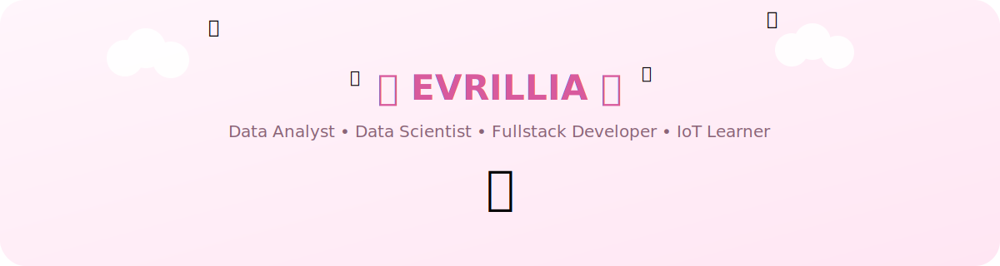
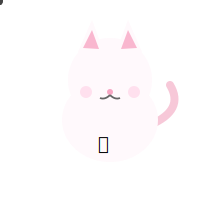
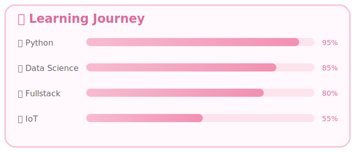
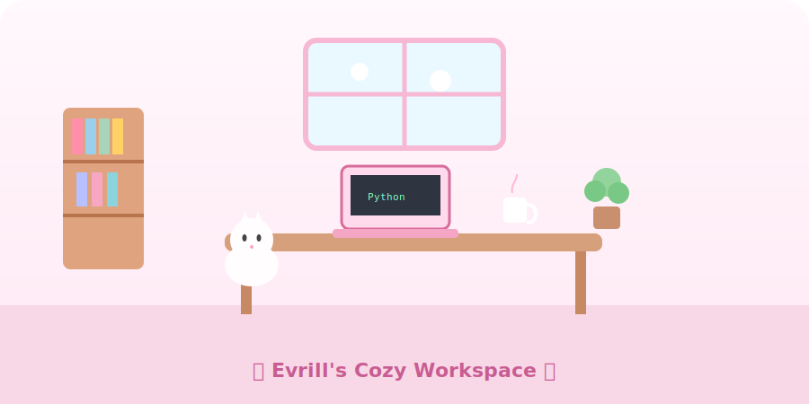

<div align="center">



<br><br>


<h1>🌸 Welcome to Evrillia's Pixel Garden 🌸</h1>

<p>
Data Analyst • Data Scientist • Fullstack Developer • IoT Learner
</p>

</div>

---

<p align="center">

</p>

<p align="center">

</p>

# 🌷 About Me

<table>
<tr>

<td width="65%">

Hi! I'm **Evrillia** 👋

🌸 Passionate about turning data into meaningful insights.

📊 Data Analyst & Data Scientist

💻 Fullstack Developer

🤖 Currently learning IoT

☕ Coffee makes debugging easier.

🌱 Always learning something new every day.

</td>

<td align="center">



</td>

</tr>
</table>

---

<p align="center">

</p>

<p align="center">

</p>

# 📚 Learning Journey

<p align="center">

</p>

---

<p align="center">

</p>

<p align="center">

</p>

# 🏡 Pixel Workspace

<p align="center">

</p>

---

<p align="center">

</p>

# 💻 Tech Stack

<p align="center">


<br><br>


<br><br>


</p>

---

<p align="center">

</p>

# 🚀 Currently Brewing

```txt
🌸 AI & Machine Learning Projects
💻 Fullstack Web Development
🤖 IoT Experiments
📊 Data Visualization Dashboard
```

---

<p align="center">

</p>

# 📊 GitHub Analytics

<p align="center">


</p>

<p align="center">


</p>

---

<p align="center">

</p>

# 💌 Connect With Me

<p align="center">

<a href="https://linkedin.com/in/Evrillia Kurniawati">

</a>

<a href="https://github.com/Evrillia-edu">

</a>

</p>

---

<div align="center">


### 🌸 Thanks for visiting my Pixel Garden 🌸

Made with 💖 by **Evrillia**

</div>
